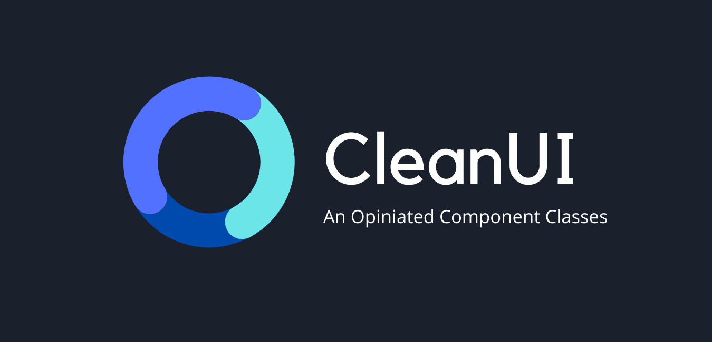

## Documentation 
[Here](https://cleanui.netlify.app/) 

# Migration to 2.x

This project (1.x version) is still experimental and is not ready yet for production. A lot of things can be changing along the way. But it totally fine if you want to use it in your side project as I used it in my side project too.

In 2.x, hopefully everything will be stable with built-in javascript function from CleanUI. __The building of 2.x version would probably be started in May 2021__. It's possibly moving to another NPM package for 2.x.

## Contributing Guides

Documentation site is built with Nuxt Content Docs theme.

You can head to `/docs` to work on documentation site.

For __CSS__ classes are located in directory `/src/components`. Please follow the file separation style.

While, `/dist` is an autogenerated directory generated on build process.

Otherwise are just unused directories / files.

## Roadmap

- [x] Alert
- [x] Badges
- [x] Button
- [x] Card
- [x] Checks and radios
- [x] Forms
- [ ] Footer
- [ ] Layout
- [ ] Modal
- [ ] Navbar
- [x] Select
- [ ] Sidebar
- [ ] Tabbar
- [x] Tooltips
